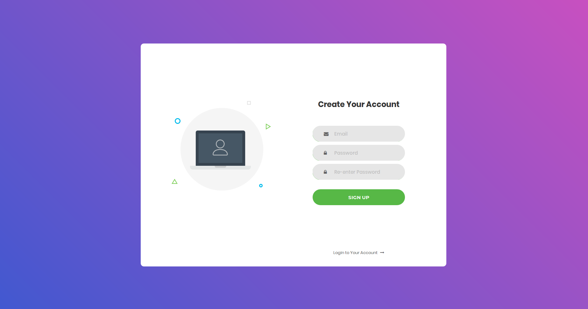
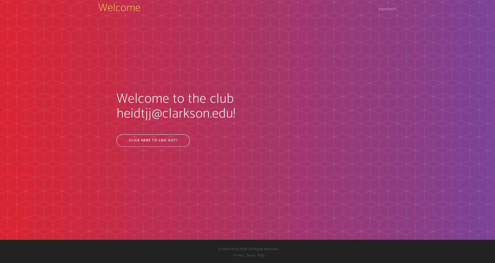

# User-Management
<h4>Assignment</h4>
Build a new web app and name it UserManagement, with JSP to (1) sign up a user, (2) log in, (3) log out. Once a user is signed up successfully, they will be considered logged in, and shown a landing page of your design. When a user logs in successfully, the same landing page should also be shown. Once a user is logged out, any subsequent attempt to access any servlet will force the user to go to the login page. When a user attempts to sign up, they must not have existed on the server, their password must be good enough (subject to the following password rules: at least 8 characters long, at least one capital, one digit, one special symbol), and the repeat password must be the same as the created password. 

The UserManagement *must not save the user's passwords directly as plain text as the server might be hacked*, and thus, passwords might be stolen; instead, hash the password and save the hash value.

All data must be stored in a mysql database.

*SQL Injection attacks must be prevented.*

The user management pages must consider common user errors and handle them in the most user friendly ways. In particular, when the user commits an error and is required to correct it, the system must preserve their work.

*When a user connects from a different IP address, force them to log in again, even if their session is still alive.*

<strong>Assigned by Prof. Daqing Hou, EE-564 Enterprise Software Development</strong>


<h4>Setting up the web app</h4>
<ol type="1">
  <li>Have <a href="http://tomcat.apache.org/">Apache Tomcat</a> installed</li>
  <li>Download this repository, and place the <a href="user-management">user-management</a> folder in the webapps folder (in Apache Tomcat directory).</li>
  <li>Create a mysql database called EE564. Feel free to change the name, but if you do, you must modify DB_NAME in <a href="user-management/WEB-INF/classes/UserManager/UserManager.java">UserManager.java</a>
    <br>ex: ```
    CREATE DATABASE EE564;
    ```</li>
  <li>In your database (EE564 or whatever you named it), create a table called USERS. Again, you can change the table name to something different, but you must modify DB_TABLE in <a href="user-management/WEB-INF/classes/UserManager/UserManager.java">UserManager.java</a> </li>
  <li>In the table that you just created</li>
</ol>  

<h2>Login page</h2>


<h2>Create Account page</h2>


<h2>Welcome page</h2>


