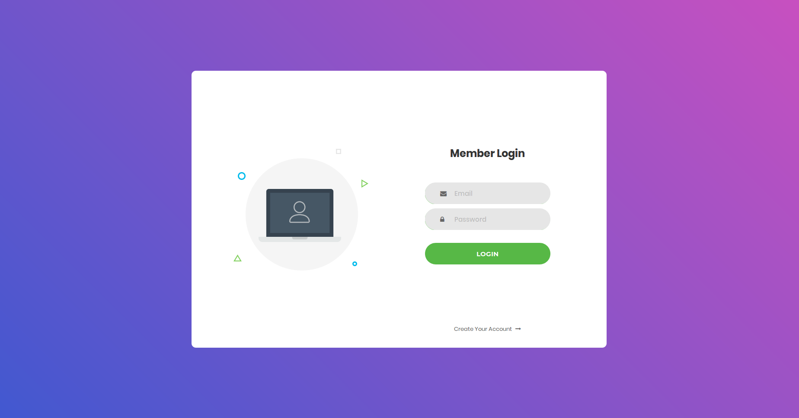

# User-Management
<h4>Assignment</h4>
Build a new web app and name it UserManagement, with JSP to (1) sign up a user, (2) log in, (3) log out. Once a user is signed up successfully, they will be considered logged in, and shown a landing page of your design. When a user logs in successfully, the same landing page should also be shown. Once a user is logged out, any subsequent attempt to access any servlet will force the user to go to the login page. When a user attempts to sign up, they must not have existed on the server, their password must be good enough (subject to the following password rules: at least 8 characters long, at least one capital, one digit, one special symbol), and the repeat password must be the same as the created password. 

The UserManagement *must not save the user's passwords directly as plain text as the server might be hacked*, and thus, passwords might be stolen; instead, hash the password and save the hash value.

All data must be stored in a mysql database.

*SQL Injection attacks must be prevented.*

The user management pages must consider common user errors and handle them in the most user friendly ways. In particular, when the user commits an error and is required to correct it, the system must preserve their work.

*When a user connects from a different IP address, force them to log in again, even if their session is still alive.*

<strong>Assigned by Prof. Daqing Hou, Clarkson University, EE-564 Enterprise Software Development</strong>

<h3>Setting up the web app</h3>
<ol type="1">
  <li>Have <a href="http://tomcat.apache.org/">Apache Tomcat</a> installed. During my development, I used apache-tomccat-7.0.84.
  </li> 
  <li>Download this repository, and place the <a href="user-management">user-management</a> folder in the webapps folder (in Apache Tomcat directory).
  </li> 
    <li>Create a mysql database called EE564 on your local machine. Feel free to change the name, but if you do, you must modify DB_NAME in 
    <a href="WEB-INF/classes/UserManager/UserManager.java">UserManager.java</a>. This is shown below:
     

~~~~
    CREATE DATABASE EE564;
~~~~
    
  </li> 
  <li>In your database (EE564 or whatever you named it), create a table called USERS. Again, you can change the table name to something different, but if you do, you must modify DB_TABLE in <a href="WEB-INF/classes/UserManager/UserManager.java">UserManager.java</a>. Insert the following attributes (id, email, password) as shown below:

 ~~~~
    CREATE TABLE USERS (
      id INT NOT NULL AUTO_INCREMENT PRIMARY KEY, 
      email VARCHAR(30),
      password VARCHAR(65353)
    );
~~~~

  </li> 
  <li>
    <strong>Configure Apache tomcat to connect to sql database</strong>. Use <a href="https://tomcat.apache.org/tomcat-9.0-doc/jndi-datasource-examples-howto.html">https://tomcat.apache.org/tomcat-9.0-doc/jndi-datasource-examples-howto.html</a> as a guide for configuring Tomcat to connect to a mysql database. Steps are also shown below:
  <strong>Insert the following xml code snippet</strong> into context.xml located in the /conf folder under the apache-tomcat directory.
    
~~~~
  <Resource name="jdbc/EE564" auth="Container" type="javax.sql.DataSource" maxActive="100" maxIdle="30" maxWait="10000" username="root" password="YourPassword" driverClassName="com.mysql.jdbc.Driver" url="jdbc:mysql://localhost:3306/EE564"/>
~~~~
Put this snippet between \<context> and \</context>. Adjust the xml code based on the database name and password which you have created.
   In web.xml, located in the /conf folder, <strong>insert the following xml code snippet:</strong>

~~~~
<web-app xmlns="http://java.sun.com/xml/ns/j2ee"
    xmlns:xsi="http://www.w3.org/2001/XMLSchema-instance"
    xsi:schemaLocation="http://java.sun.com/xml/ns/j2ee
http://java.sun.com/xml/ns/j2ee/web-app_2_4.xsd"
    version="2.4">
  <description>EE564 User Management</description>
  <resource-ref>
      <description>DB Connection</description>
      <res-ref-name>jdbc/EE564</res-ref-name>
      <res-type>javax.sql.DataSource</res-type>
      <res-auth>Container</res-auth>
  </resource-ref>
</web-app>
~~~~
Adjust the xml code to match the database name which you created (i.e EE564).
 
</li>
<li>
Put mysql-connector-java-5.1.46-bin.jar and mysql-connector-java-5.1.46.jar into the /lib folder under apache-tomcat. You can download these at <a href="https://dev.mysql.com/downloads/connector/j/5.1.html">https://dev.mysql.com/downloads/connector/j/5.1.html</a>. You may need to create an accout.
</li> 
  <li>Now start the application. Go to the apache-tomcat directory and enter the bin folder. Using the terminal (while on linux), enter the following command to start the Apache Tomcat server.

~~~~
    ./startup.sh
~~~~
Note: to shut down the Apache Tomcat server, use the following command (while using linux).
~~~~
    ./shutdown.sh
~~~~
</li> 
<li>Finally, in an internet browser (Chrome, FireFox, etc.), go to: <a href="http://localhost:8080/user-management/signin.jsp">http://localhost:8080/user-management/signin.jsp</a></li>

</ol>  

<h2>Login page</h2>

<h2>Create Account page</h2>

<h2>Welcome page</h2>

